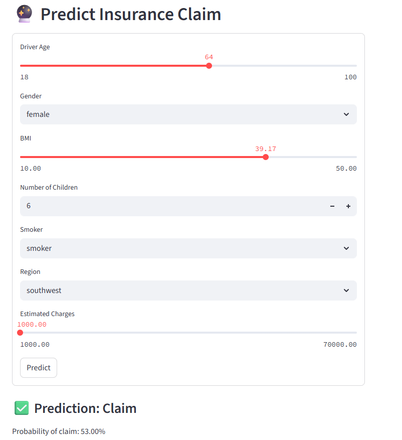
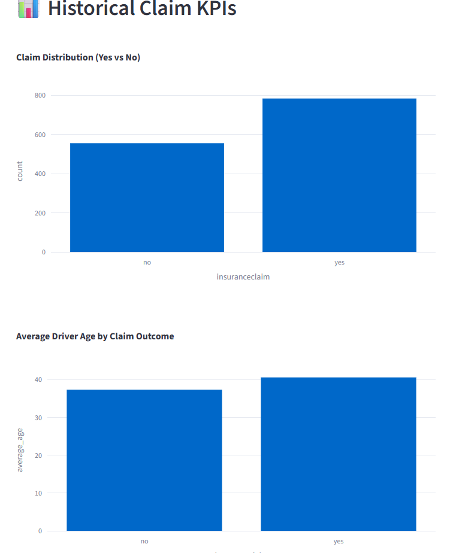

# 🔮 Insurance Claim Prediction Dashboard

Analyze insurance policyholder data, explore key metrics, and predict expected insurance claims using an interactive Streamlit dashboard.

---

## ✅ Tools Used

- Python 3
- pandas
- numpy
- scikit-learn
- SQLite
- Streamlit
- Plotly

---

## 📦 How to Use

**1️⃣ Clone the repository:**

git clone https://github.com/kacperguzydev/Unicorn_Companies_Analysis.git

**2️⃣ Install required packages:**

pip install -r requirements.txt

**3️⃣ Prepare the data (run these scripts in order):**

- python transform.py
- python load_to_db.py
- python sql_analysis.py
- python prediction.py

**4️⃣ Launch the dashboard locally:**

streamlit run dashboard.py

## 🖼️ Screenshots

- 🔮 Prediction Interface:**

- 📊 Claim KPIs Dashboard:**

